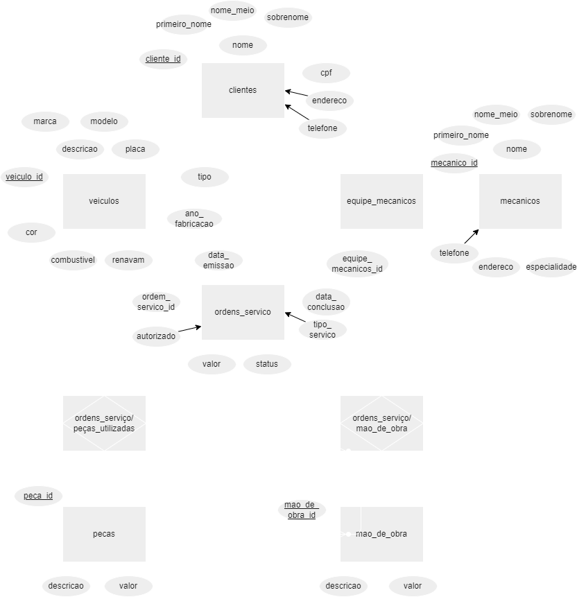
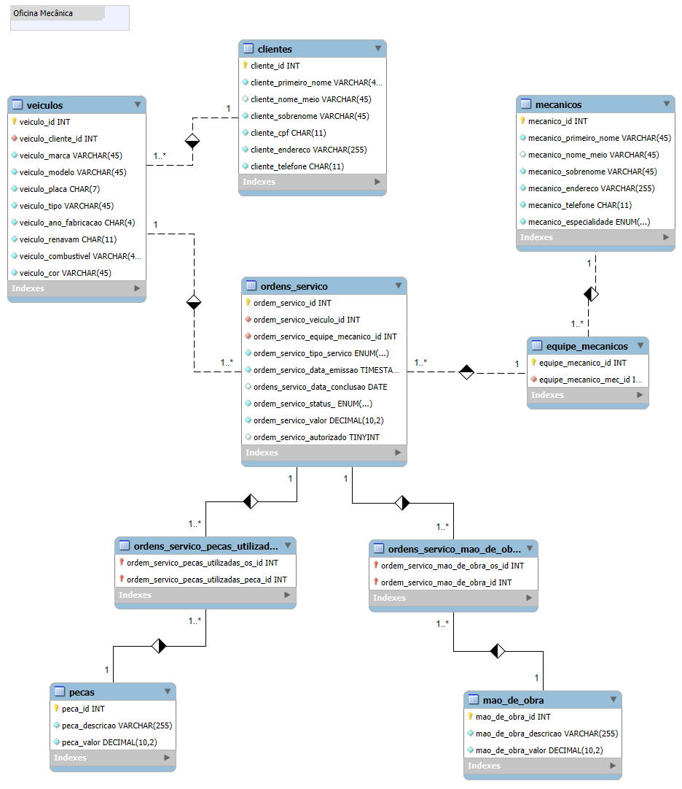

# Banco de Dados para oficina mecânica

Este projeto tem como objetivo a criação de um banco de dados para uma oficina mecânica e será utilizado para o armazenamento, organização e consulta de informações conforme proposto no desafio do Curso de Fundamentos de Banco de Dados. 

## Modelo Conceitual

  

## Modelo Lógico

  

### 🛠️ Tecnologias
As seguintes ferramentas foram utilizadas:

- [draw.io](https://www.drawio.com/) utilizada para construção do modelo conceitual.

- [MySQL](https://www.mysql.com/) utilizada para a construção do modelo lógico.

- [VScode](https://code.visualstudio.com/) utilizado para a criação do modelo conceitual.  
OBS: Você deve instalar no seu VScode a extensão Draw.io Integration para que seja possível realizar a conexão de seu VScode com o software Draw.io. 
Caso não utilize o VScode pode criar seu modelo conceitual diretamente no software Draw.io.

### 📄 Scripts
- [Script_SQL_BD_oficina_mecânica](bd_oficina_mecanica.sql) 
Este script foi elaborado para criação do modelo físico do Banco de Dados Oficina Mecânica.
